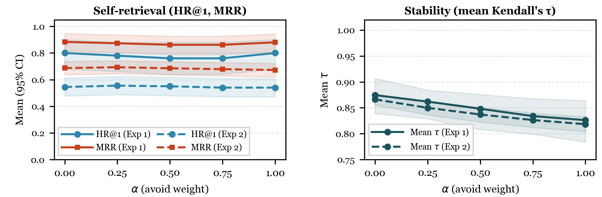

<!-- CADSCOM 2026 Formatting Notes for Transfer to Word/LaTeX (match CADSCOM_Submission_Template):
     - Font: Georgia 10pt body, 13pt bold H1, 11pt bold-italic H2, 10pt bold H3
     - Layout: Single column, single-spaced, US Letter, 1-inch margins all around
     - Section headings: NOT numbered, left-justified
     - Figures and tables: put the caption BELOW the figure or table (never above). Georgia 10pt bold, centered.
       In this .md, each **Figure N.** / **Table N.** line is that caption; Markdown image [...] alt text is not the typeset caption.
     - Running header: abbreviated title (max 8 words), e.g. "Tessituragram Vocal Repertoire Ranking Framework"
     - No author info on cover page for blind review submission
     - References: New MIS Quarterly style
     - Results order (do not reorder): RQ1 prose -> Figure 1 PNG (caption directly under figure) -> RQ2 + Table 2 (caption under table) ->
       subsection "Sensitivity to alpha" -> intro -> Figure 2 PNG (caption under figure) -> alpha takeaway paragraph -> RQ3 + Table 3 (caption under table).
       Assets: paper_draft/figures/rq1_oracle_hr1_mrr.png, alpha_sensitivity_hr1_mrr_tau.png
-->

<!-- ============================== COVER PAGE (not counted toward 6-page limit) ============================== -->

# Content-Based Vocal Repertoire Ranking Framework Using Duration-Weighted Pitch Distributions

## Abstract

Vocal repertoire selection affects vocal load and injury risk. Tessitura—how much singing time falls on each pitch, weighted by note length—captures where a line sits in the register. Tessituragram tools typically summarize a score the user already has; they do not rank a library by fit to stated pitch preferences. We present a content-based framework: each vocal line is a tessituragram from machine-readable MusicXML. The user gives range, favorites, and avoids; we range-filter, build an ideal pitch profile, and rank by cosine similarity minus a penalty for duration on avoided pitches (α = 0.5).

We evaluate offline with synthetic self-retrieval: a profile is built from a target line (range; four pitches with most total duration as favorites, two with least as avoids), and we ask how often that same line ranks highly among other filtered lines—an identifiability check, not a user study. Two complementary designs on the OpenScore Lieder corpus (Method) use 101 solo lines (one per work) and 1,655 lines from 1,419 works. We compare to a null (range filter + random ranking) and cosine-only (α = 0).

Full-model HR@1 is 76% vs 6% null (compact design) and 55% vs 2% (expanded); HR@5 is 86% vs 7% null (expanded). Rankings are stable under small preference edits (mean Kendall's τ ≈ 0.84–0.85). Paired full vs cosine-only intervals for HR@1 and mean reciprocal rank include zero in the expanded design; the compact design favors cosine-only on HR@1 for this sample. Results support internal consistency under these offline protocols. Claims are limited to synthetic profiles and symbolic scores; human evaluation and other genres are future work.

**Keywords:** tessitura, tessituragrams, vocal repertoire recommendation, content-based recommendation, cosine similarity, music information retrieval, MusicXML

<!-- ============================== PAGE 1 — INTRODUCTION ============================== -->

## Introduction

Choosing repertoire that matches a singer's vocal characteristics is important for vocal health: misalignment between a piece's demands and a singer's capabilities can increase the risk of strain or injury (Apfelbach, 2022; Phyland et al., 1999). A central factor in those demands is tessitura—where in the vocal range the line sits most of the time, i.e. the pitches on which the voice spends the most time (Apfelbach, 2022; Schloneger et al., 2024; Thurmer, 1988). In practice, singers and teachers often filter by a piece's written range (the highest and lowest notes in the score) or by vocal classification such as Fach—the system used in opera to categorize voices by range, weight, and color. A piece's written range alone, however, does not show how much time the voice spends in different parts of that span, and Fach labels are not consistently defined across pedagogical contexts (Schloneger et al., 2024).

A **tessituragram** is a histogram of how much singing time falls on each notated pitch, typically weighted so longer notes count more than short ones (Thurmer, 1988; Titze, 2008). Tools such as Tessa extract tessitura from MusicXML (machine-readable scores) and produce such profiles and summary statistics for a given piece (Apfelbach, 2022). These tools are analytic: they help assess a piece after it is chosen, not find new pieces whose tessitura is likely to fit the singer.

This paper explores whether tessituragrams can support content-based ranking of repertoire candidates based on singer preferences—an offline, cold-start setting in which structured pitch preferences replace collaborative signal. We build a tessituragram-based framework that filters songs by the user's range, constructs an ideal pitch profile from favorite pitches and pitches to avoid, and ranks candidates by cosine similarity to that profile minus a penalty for time spent on avoid pitches. The framework is validated through two offline experiments with automatically generated user profiles—**different protocols**, not duplicate runs for extra weight (see Method). The first uses 101 vocal lines (one per composition) on a compact library with i.i.d. bootstrap. The second evaluates 1,655 vocal lines from 1,419 compositions in the same corpus—about **16×** more lines—with a flattened item set (including multi-part works as separate lines), larger typical candidate pools after range filtering, and cluster bootstrap where needed. **Empirical claims are confined to these offline metrics and protocols**, not vocal-health effectiveness or unconstrained real-world singer behavior.

The contributions of this research are as follows:

1. A content-based ranking pipeline combining duration-weighted tessituragrams with user-specified favorite and avoid pitches, scored using cosine similarity minus an avoid-penalty.
2. A **two-protocol** offline evaluation of **synthetic self-retrieval** (identifiability under the oracle protocol), plus ranking-stability and implementation checks, with null and cosine-only baselines: compact single-line-per-work library (101 lines) vs. expanded flattened library (1,655 lines from 1,419 compositions).
3. An evaluation protocol for the expanded library that samples queries over eligible vocal lines and uses **work-level (cluster) bootstrap** inference where multiple lines can come from the same composition (Cameron et al., 2008; Field and Welsh, 2007).

**Paper roadmap.** *Results* presents **RQ1** (self-retrieval; **Figure 1**), **RQ2** (stability), sensitivity to **α** (**Figure 2**), then **RQ3** (implementation checks).

<!-- ============================== PAGES 1–2 — RELATED WORK ============================== -->

## Related Work

### *Tessituragram Analysis and Repertoire Selection*

Thurmer (1988) formalized the tessituragram as the distribution of pitch occurrence in the vocal line; Titze (2008) added duration weighting. Recent work uses duration-based and dose-based summaries to characterize demand across works or cycles (Schloneger et al., 2024; Patinka, 2024). On the applied side, Nix (2014) evaluates objective methods—including voice range profiles, tessituragrams, and dosimetry—for matching pieces to singers in pedagogy; Apfelbach's Tessa (2022) automates tessitura extraction from MusicXML. These contributions support evaluating suitability of a chosen piece, but not recommending pieces whose tessitura is likely to fit.

### *Music Information Retrieval*

MIR addresses content-based search and retrieval of music, including symbolic (score-based) methods (Casey et al., 2008; Gurjar and Moon, 2018). For symbolic music, pitch histograms and duration distributions are common features (Corrêa and Rodrigues, 2016). Cosine similarity suits such pitch-indexed vectors because it measures proportional alignment (Müller, 2015). For the voice, octave matters: unlike transposition-invariant melodic similarity (Mongeau and Sankoff, 1990), tessitura modelling must keep pitch in specific octaves to reflect register and demand. Our system is related to the query-by-example paradigm in MIR, though the user supplies pitch preferences rather than an example song (Casey et al., 2008; Müller, 2015).

### *Recommender Evaluation*

Offline evaluation is standard when human relevance judgments are unavailable (Herlocker et al. 2004; Urbano et al. 2013). In music recommendation, Gruson et al. (2019) showed that offline metrics can align with A/B outcomes. Shared implementations of evaluation metrics improve comparability in MIR (Raffel et al. 2014). Common ranking metrics include hit rate at *k* and mean reciprocal rank. Kendall's τ compares two ranked lists (Kendall, 1948). Uncertainty is often quantified with bootstrap confidence intervals (Efron and Tibshirani, 1993). When observations are not independent—e.g., several vocal lines from one composition—**cluster bootstrap** resamples whole works (or clusters), not individual lines, so intervals are not overstated (Cameron et al., 2008; Field and Welsh, 2007). We are not aware of prior evaluation of tessitura-based vocal recommenders with these metrics and explicit baselines. The following section specifies our corpus, scoring function, synthetic oracle, and bootstrap schemes.

<!-- ============================== PAGES 2–3 — METHOD ============================== -->

## Method

The section has three subsections: data and features (Table 1), the ranking function, and synthetic profiles with bootstrap inference and RQ1 reporting conventions.

### *Data and Song Library*

All MusicXML source files come from the OpenScore Lieder Corpus, an openly licensed (CC0) collection of art songs with structured metadata for MIR research (Gotham and Jonas, 2022). The corpus is predominantly Lieder (German art song) and French mélodies; tessitura and vocal fit are central concerns in both traditions. We parse MusicXML with music21 (Cuthbert and Ariza 2010), extract the vocal line, and build one tessituragram per line: a mapping from each MIDI pitch (e.g. 60 = middle C) to total duration in quarter-note beats—**MIDI** assigns a number to each pitch so octaves are explicit. Duration weighting reflects that sustaining a pitch is more demanding than a brief note (Titze 2008). Table 1 lists features extracted or derived per vocal line.

Two libraries are used. The first (Experiment 1) contains 101 art songs (e.g. Schubert, Clara and Robert Schumann, Debussy, Fauré). The second (Experiment 2) contains 1,655 vocal lines from 1,419 compositions. Because some compositions contain multiple voice parts (e.g. duets), each vocal line is treated separately. Of the 1,655 lines, 342 come from multi-part works and 1,313 from single-voice songs. The expanded library spans a wider range of composers and styles. No human relevance judgments were collected.

**Relation between experiments.** We report two **protocols**, not two independent replications. Experiment 1 targets a compact **single-line-per-work** library (for that dataset, at most one vocal line per composition) and uses **i.i.d.** bootstrap over query-level outcomes. Experiment 2 uses a **flattened** library (each line is an item; multi-part works contribute multiple lines) and **work-level (cluster) bootstrap** because several sampled lines can belong to the same composition. **The libraries overlap in source and repertoire; they are not statistically independent samples from disjoint populations**, so the experiments should not be read as doubling evidence in the sense of two unrelated draws.

| Feature | Source | Description |
|---|---|---|
| Pitch, duration (per note) | MusicXML | Converted to MIDI number; duration in quarter beats, summed per pitch for tessituragram. |
| Part/voice | MusicXML | Vocal line only. |
| Tessituragram | Derived | MIDI pitch → total duration (duration-weighted). |
| min\_midi, max\_midi | Derived | Written pitch range of the vocal part. |
| Composer, title, filename | MusicXML/corpus | Work and file identification. |

<!-- CADSCOM: Table 1 caption below table (next line). -->
**Table 1. Features Extracted from MusicXML and Stored per Vocal Line**

### *Ranking Framework and Scoring*

**Inputs.** The singer supplies (1) a comfortable vocal range (lowest and highest MIDI pitch); (2) favorite notes; (3) notes to avoid.

**Range filter.** Songs whose written pitch range extends beyond the singer's stated range are excluded, so every retained candidate is singable within that span (candidate set C).

**Ideal vector construction.** A dense vector over [min\_midi, …, max\_midi] is initialized to a base weight of 0.2, with +1.0 at favorites and −1.0 at avoids. The base weight keeps non-favorite in-range pitches from being zeroed out before normalization; we do not sweep this hyperparameter in our experiments. Negative entries are clamped to 0 and the vector is L2-normalized so similarity depends only on direction (Müller, 2015).

**Song scoring and ranking.** Each song's tessituragram is converted to a dense vector and L1-normalised so each entry is the proportion of total vocal duration on that pitch; the avoid penalty is therefore the total mass on avoided pitches. The final score is:

> final\_score = cosine\_similarity(song, ideal) − α × avoid\_penalty

where α controls the weight of the avoid penalty (α = 0.5 in the main experiments). The avoid penalty is the proportion of the song's vocal duration spent on notes to avoid. Scores are rounded to four decimal places; ties are broken by filename.

### *Synthetic User Profiles and Statistical Methods*

**Synthetic profiles.** Human relevance labels are unavailable, so we follow standard offline practice (Herlocker et al., 2004; Urbano et al., 2013). For a chosen **profile line** we set the user's range to that line's written range, take the top 4 pitches by duration as favorites and the bottom 2 as notes to avoid (disjoint). This **fixed sparse oracle** is a deliberate test harness: it is not claimed to be an optimal or psychologically realistic way to elicit preferences, but it defines a reproducible **identifiability target**—a known correct item for the evaluation. That line is the **designated target**. **Synthetic self-retrieval** (Results) asks whether the ranker recovers that item among range-filtered *other* lines, not whether human judges would agree.

**Experiment 1 (101-line library).** We draw **50** queries uniformly at random **without replacement** from the valid pool (**seed 42**). Uncertainty uses **i.i.d. bootstrap resampling** of query-level (or baseline-level) outcomes (10,000 resamples; Efron and Tibshirani, 1993), appropriate when each query line comes from a distinct composition.

**Experiment 2 (1,655-line library).** Queries are drawn uniformly **without replacement from the pool of eligible vocal lines** (not uniformly from compositions): multi-part works contribute more lines to that pool, so they are represented more heavily in the sampling frame than in a uniform-by-work design. **Cluster (work-level) bootstrap** follows Cameron et al. (2008) and Field and Welsh (2007) to account for **within-work dependence** when several sampled queries share a composition—we resample work IDs with replacement, then include all query lines from each resampled work. Query sampling uses **seed 42**; bootstrap resampling for RQ1 uses **seed 43** so query draws and uncertainty resampling are independently reproducible. **Canonical outputs** for Experiment 2 are archived under `experiment_results/`; for Experiment 1 (101-line library) under `previous_paper_and_experiments/previous_experiment_results/` (`old_*.json`). For Experiment 1, `previous_paper_and_experiments/previous_experiment_scripts/old_run_alpha_sensitivity.py` loads the five RQ2 `baseline_profiles` from `old_RQ2_results.json` so the α sweep over τ uses the same **130** perturbations as the main RQ2 run (Table 2). **Fixed seeds** are as stated above; `experiment/run_alpha_sensitivity.py` documents SHA-256–derived bootstrap RNGs for α-sensitivity cells where applicable.

**Inference scope.** Bootstrap percentile intervals summarize uncertainty for the **mean query-level metric** on the **fixed sampled query set** under the stated resampling scheme. They are **not** intervals over repeated redraws of queries from the corpus; a different query seed would in general shift point estimates. RQ3 pools correlations via Fisher's z (Fisher, 1915).

RQ1 main results and RQ1 baselines use the **same random query draw** within each experiment (same eligibility rule and query seed).

**RQ1 reporting.** We treat **HR@1** and **MRR** as the primary **oracle self-retrieval** performance measures (hit-rates and mean reciprocal rank on the controlled task); **HR@3** and **HR@5** provide complementary views of the upper tail of the list. Paired comparisons of full versus cosine-only use the same queries; we do **not** apply multiplicity correction across metrics—secondary contrasts should be read as exploratory.

<!-- ============================== PAGES 3–5 — RESULTS ============================== -->

## Results

### *Research Question 1 (RQ1): Self-Retrieval Performance (Controlled Identifiability)*

**Question:** When preferences are synthesized from a vocal line’s own tessituragram, **how often** does the system rank that **same line** first (or in the top three or five) among range-filtered candidates?

We use a **fixed sparse oracle** from each line’s duration-weighted usage (Method). RQ1 asks whether the published scorer recovers that line among **other** filtered candidates—an **offline identifiability** check, not whether human singers would agree (Herlocker et al., 2004; Urbano et al., 2013). **Pools, seeds, baselines, and bootstrap schemes are in Method.**

**Figure 1** gives **HR@1** (fraction of queries with the target ranked first) and **MRR** (mean reciprocal rank); brackets are **95% bootstrap** intervals for the **fixed** query draw. **Experiment 1:** full **0.76** / **0.86**, cosine **0.80** / **0.88**; paired ΔHR@1 **−0.04** [−0.10, 0.00]. **Experiment 2:** full **0.55** / **0.69** vs cosine HR@1 **0.545**, MRR **0.69**; paired ΔHR@1 and ΔMRR include zero. **Secondary** HR@3 / HR@5 (null / cosine / full): Exp 1 **0.18 / 1.00 / 0.98** and **0.30 / 1.00 / 1.00**; Exp 2 **0.06 / 0.78 / 0.80** and **0.07 / 0.86 / 0.86** (exploratory contrasts; no multiplicity adjustment). Null HR@1 **6%** vs **2%**. The experiments differ in corpus, candidate-pool size, and sampling frame—they are **not** a controlled comparison of library size. In Experiment 2 the target is not first in **45%** of queries, consistent with near-duplicate tessituragrams.

<!-- Word: Insert Figure 1 here — file: paper_draft/figures/rq1_oracle_hr1_mrr.png. CADSCOM: caption below figure only (next paragraph). -->

**Figure 1.** HR@1 and MRR (95% bootstrap CIs; fixed query draw—Method). **Left:** Experiment 1 (i.i.d. bootstrap over queries). **Right:** Experiment 2 (work-level cluster bootstrap). Full vs cosine HR@1 in Experiment 2: **0.550** vs **0.545** (three decimals).

### *Research Question 2 (RQ2): Ranking Stability*

**Question:** When we add or remove one favorite note or note to avoid, how similar is the new ranking to the original?

**Procedure:** In Experiment 1, we use 5 baseline profiles (candidate set ≥ 10 songs each, 130 total perturbations). In Experiment 2, we use 20 baseline profiles (candidate set ≥ 10, 580 total perturbations, all 20 from distinct compositions). For each baseline, we obtain the reference ranking and generate all one-note perturbations (add or remove one favorite or avoid note). For each perturbation we compute Kendall's τ (Kendall, 1948). τ ranges from −1 to 1; values above 0.7 indicate strong agreement. Table 2 gives mean τ per baseline with 95% CI. **τ measures how much the induced ranking moves under local edits to the encoded preference lists; it does not validate pedagogical acceptance or user satisfaction with such edits.**

Both experiments show strong stability (τ > 0.7). Mean τ for the full model is 0.85 (Experiment 1) and 0.84 (Experiment 2)—similar despite about **16×** more vocal lines in Experiment 2 and four times as many stability baselines. Cosine-only is slightly higher in both cases (0.87), with overlapping CIs. The null baseline hovers near τ ≈ 0 as expected.

| Model | Experiment 1 (5 baselines, 130 perturbations) | Experiment 2 (20 baselines, 580 perturbations) |
|---|---|---|
| | Mean τ (95% CI) | Mean τ (95% CI) |
| Null (random) | −0.04 [−0.05, −0.02] | 0.00 [−0.002, 0.007] |
| Cosine-only (α = 0) | 0.87 [0.84, 0.91] | 0.87 [0.86, 0.88] |
| Full (α = 0.5) | 0.85 [0.81, 0.88] | 0.84 [0.82, 0.85] |

<!-- CADSCOM: Table 2 caption below table (next line). -->
**Table 2. Ranking stability: mean Kendall's τ per baseline (95% CI). τ = 1 means identical order; τ near 0 means unrelated rankings.**

### *Sensitivity to α*

**α** controls how strongly the scorer penalizes time spent on **notes to avoid** in the ranking function (α = 0 is cosine-only—the penalty is off). To see how much conclusions depend on that choice, we repeat **RQ1** (self-retrieval) and **RQ2** (stability) at **α ∈ {0, 0.25, 0.5, 0.75, 1}**, using the **same random query draws and the same RQ2 baseline sets** as in Figure 1 and **Table 2** (Experiment 1: five baselines, Table 2 protocol; Experiment 2: twenty baselines; bootstrap schemes: Method).

<!-- Word: Insert Figure 2 here — after Table 2, in subsection "Sensitivity to alpha"; file: paper_draft/figures/alpha_sensitivity_hr1_mrr_tau.png. CADSCOM: caption below figure only (next paragraph). -->

**Figure 2.** **Lines** = mean metric on the fixed sample; **shaded bands** = **95% bootstrap percentile** intervals. **Experiments:** **solid** = Experiment 1 (101-line library); **dashed** = Experiment 2 (expanded library). **Left:** self-retrieval—**HR@1** is the fraction of queries with the target ranked first; **MRR** is mean reciprocal rank (average 1/rank). **Right:** stability—**τ** is Kendall’s correlation between rankings before and after one-note edits to favorites/avoids (higher = more agreement; gray horizontal reference at **0.7**). **HR@3** and **HR@5** are **not** plotted; point estimates vary little with α (Experiment 1: HR@3 **0.96–1.00**, HR@5 **1.00**; Experiment 2: HR@3 **0.78–0.81**, HR@5 **0.84–0.86**); full CIs in archived α-sensitivity JSON (Method).

Within each experiment, **HR@1** and **MRR** are roughly **flat** across α (**Figure 2**); point estimates need not move monotonically with α on a fixed query draw. **τ** **decreases** as α increases (about **0.87** at α = 0 to **0.83** / **0.82** at α = 1 in Experiments 1 / 2), with τ ≥ **0.82** at α = 1. We report **α = 0.5** as a fixed operating point between cosine-only and stronger avoid weighting; we do **not** claim an optimal α on the basis of these offline metrics alone.

### *Implementation Verification (RQ3)*

As a verification step, we check three properties of the scoring pipeline in both experiments: (a) Do scores spread out meaningfully? (b) Does final\_score = cos − α × avoid hold numerically? (c) Do components correlate in the directions the formula predicts?

In Experiment 1, we use 25 synthetic profiles (≥ 10 candidates each). In Experiment 2, we use 50 profiles (≥ 10 candidates each, 49 from distinct compositions). Table 3 reports the identity residual max \|final − (cos − 0.5×avoid)\|, mean range of final\_score, and Spearman ρ (Spearman, 1904) aggregated across profiles within each experiment via Fisher's z (Fisher, 1915).

| Quantity | Experiment 1 (25 profiles) | Experiment 2 (50 profiles) |
|---|---|---|
| max \|final − (cos − 0.5×avoid)\| | 0 | 0 |
| Mean range (final\_score) | 0.758 | 1.030 |
| ρ(final, cos) | 0.987 | 0.989 |
| ρ(final, avoid) | −0.350 | −0.318 |
| ρ(cos, favorite\_overlap) | 0.935 | 0.921 |

<!-- CADSCOM: Table 3 caption below table (next line). -->
**Table 3. RQ3 implementation checks. Identity residual is pointwise \|final\_score − (cos − 0.5×avoid)\| at α = 0.5. Spearman ρ aggregated across profiles via Fisher’s z.**

<!-- ============================== PAGES 5–6 — DISCUSSION, LIMITATIONS, CONCLUSION ============================== -->

## Discussion and Limitations

Range filtering plus cosine similarity over duration-weighted pitch profiles **strongly beats** random ordering after the same filter and stays **stable** under small preference edits in both protocols. Experiment 2 adds larger |C| and 1,655 lines from 1,419 compositions. Key quantities are **consistent in direction** across protocols (not independent confirmations): mean τ for the full model is 0.85 (Experiment 1) and 0.84 (Experiment 2); RQ3 confirms the implemented score matches cos − α×avoid; full and cosine-only dominate the null on self-retrieval.

Raw HR@1 falls from 0.76 to 0.55 (full model) between experiments, but—as in the Results—this gap **confounds** corpus composition, |C|, null difficulty, and line-level sampling weights; it is not identified with library size alone. In Experiment 2, HR@5 for the full model is **0.86**.

On the **primary** RQ1 metrics we emphasize (HR@1, MRR), cosine-only and the full model are **not** separated by paired intervals in Experiment 2, and Experiment 1’s paired ΔHR@1 favors cosine-only on this draw. Choosing between them is therefore **not** dictated by these offline self-retrieval results alone. The avoid term remains part of the design when users supply pitches to avoid; our oracle defines those avoids from the **least-used** pitches of the target line, which limits how much the penalty can separate the target from near-duplicate lines—**so paired full-versus-cosine contrasts here mainly probe cosine similarity, not a high-signal test of user-supplied avoids.** Bootstrap schemes differ only where Experiment 2 requires cluster resampling (Method).

**Limitations.** (1) **Scope of inference.** We use one **fixed** random query sample (seed 42) on one corpus; bootstrap intervals describe uncertainty for **that** sample, not for all music or new query draws. In Experiment 2, lines from the same work can be related. Contrasts between full and cosine-only models do **not** adjust for multiple metrics. (2) **No human ratings.** Profiles are synthetic; RQ1 asks whether the system recovers a **hidden target line** under a fixed rule—not whether real singers would like the rankings or hold realistic preferences. (3) **Comparing experiments.** Side-by-side numbers mix different library sizes, candidate pools, and sampling rules; they are **descriptive**, not proof of a causal effect of catalog size, and the two protocols are not independent replications. (4) **Corpus.** Both runs use the OpenScore Lieder art-song corpus; other genres (e.g. opera, popular song) are untested. (5) **What we model.** Only pitch and time spent on each pitch; we omit dynamics, tempo, text, and accompaniment. (6) **Full vs cosine-only.** Paired intervals for HR@1 and MRR often overlap (Experiment 2 includes zero; Experiment 1’s ΔHR@1 favors cosine on this draw). The oracle builds “avoid” lists from the target line itself, so user-chosen avoids are **not** isolated—these contrasts mainly reflect cosine similarity.

## Conclusion

We presented a content-based ranking framework that uses duration-weighted tessituragrams to rank vocal repertoire by pitch-preference match. Across **two offline protocols**—compact single-line-per-work library (101 lines) and expanded flattened library (1,655 lines from 1,419 compositions)—the full model and cosine-only baseline **strongly outperform** a null baseline on **synthetic self-retrieval**, and rankings stay stable under small preference perturbations (mean τ ≥ 0.82 for the full model at every α in **Figure 2**). RQ3 confirms the score implements final = cos − α×avoid exactly. Mean ranking stability is similar in both experiments (τ ≈ 0.85 vs. 0.84); in Experiment 2, HR@5 for the full model is **0.86**. Paired contrasts on the primary self-retrieval metrics do **not** support a systematic mean advantage for the avoid penalty over cosine-only under our oracle. Future work should evaluate with real user preferences and human relevance judgments, expand to more diverse repertoire (e.g. opera, musical theatre, popular song), and incorporate additional factors such as dynamics, tempo, and text setting.

<!-- ============================== REFERENCES (not counted toward 6-page limit) ============================== -->

## References

Apfelbach, C. S. 2022. "Tessa: A Novel MATLAB Program for Automated Tessitura Analysis," *Journal of Voice* (36:5), pp. 599–607. (https://doi.org/10.1016/j.jvoice.2020.07.039).

Cameron, A. C., Gelbach, J. B., and Miller, D. L. 2008. "Bootstrap-Based Improvements for Inference with Clustered Errors," *Review of Economics and Statistics* (90:3), pp. 414–427. (https://doi.org/10.1162/rest.90.3.414).

Casey, M. A., Veltkamp, R., Goto, M., Leman, M., Rhodes, C., and Slaney, M. 2008. "Content-Based Music Information Retrieval: Current Directions and Future Challenges," *Proceedings of the IEEE* (96:4), pp. 668–696. (https://doi.org/10.1109/JPROC.2008.916370).

Corrêa, D. C., and Rodrigues, F. A. 2016. "A Survey on Symbolic Data-Based Music Genre Classification," *Expert Systems with Applications* (60), pp. 190–210. (https://doi.org/10.1016/j.eswa.2016.04.008).

Cuthbert, M. S., and Ariza, C. 2010. "music21: A Toolkit for Computer-Aided Musicology and Symbolic Music Data," in *Proceedings of the 11th International Society for Music Information Retrieval Conference*, pp. 637–642. (https://ismir2010.ismir.net/proceedings/ismir2010-108.pdf).

Efron, B., and Tibshirani, R. J. 1993. *An Introduction to the Bootstrap*, New York, NY: Chapman and Hall/CRC. (https://doi.org/10.1201/9780429246593).

Field, C. A., and Welsh, A. H. 2007. "Bootstrapping Clustered Data," *Journal of the Royal Statistical Society: Series B* (69:3), pp. 369–390. (https://doi.org/10.1111/j.1467-9868.2007.00593.x).

Fisher, R. A. 1915. "Frequency Distribution of the Values of the Correlation Coefficient in Samples from an Indefinitely Large Population," *Biometrika* (10:4), pp. 507–521. (https://doi.org/10.1093/biomet/10.4.507).

Gotham, M. R. H., and Jonas, P. 2022. "The OpenScore Lieder Corpus," in *Music Encoding Conference Proceedings 2021*, S. Münnich and D. Rizo (eds.), Humanities Commons, pp. 131–136. (https://doi.org/10.17613/1my2-dm23).

Gruson, A., Chandar, P., Charbuillet, C., McInerney, J., Hansen, S., Tardieu, D., and Carterette, B. 2019. "Offline Evaluation to Make Decisions about Playlist Recommendation Algorithms," in *Proceedings of the 12th ACM International Conference on Web Search and Data Mining*, New York, NY: ACM, pp. 420–428. (https://doi.org/10.1145/3289600.3291027).

Gurjar, K., and Moon, Y. S. 2018. "A Comparative Analysis of Music Similarity Measures in Music Information Retrieval Systems," *Journal of Information Processing Systems* (14:1), pp. 32–55. (https://jips-k.org/digital-library/2018/14/1/32).

Herlocker, J. L., Konstan, J. A., Terveen, L. G., and Riedl, J. T. 2004. "Evaluating Collaborative Filtering Recommender Systems," *ACM Transactions on Information Systems* (22:1), pp. 5–53. (https://doi.org/10.1145/963770.963772).

Kendall, M. G. 1948. *Rank Correlation Methods*, London, UK: Charles Griffin. (https://search.worldcat.org/title/3641982).

Mongeau, M., and Sankoff, D. 1990. "Comparison of Musical Sequences," *Computers and the Humanities* (24:3), pp. 161–175. (https://doi.org/10.1007/BF00117340).

Müller, M. 2015. *Fundamentals of Music Processing: Audio, Analysis, Algorithms, Applications*, Cham, Switzerland: Springer. (https://doi.org/10.1007/978-3-319-21945-5).

Nix, J. 2014. "Measuring Mozart: A Pilot Study Testing the Accuracy of Objective Methods for Matching a Song to a Singer," *Journal of Singing* (70:5), pp. 561–572.

Patinka, P. M. 2024. "Quantitative Analysis of Tessitura and Density in Franz Schubert's Die schöne Müllerin," *Journal of Voice*, Advance online publication. (https://doi.org/10.1016/j.jvoice.2024.09.035).

Phyland, D. J., Oates, J. M., and Greenwood, K. M. 1999. "Self-Reported Voice Problems among Three Groups of Professional Singers," *Journal of Voice* (13:4), pp. 602–611. (https://doi.org/10.1016/S0892-1997(99)80014-9).

Raffel, C., McFee, B., Humphrey, E. J., Salamon, J., Nieto, O., Liang, D., and Ellis, D. P. W. 2014. "mir_eval: A Transparent Implementation of Common MIR Metrics," in *Proceedings of the 15th International Society for Music Information Retrieval Conference*, pp. 367–372. (https://archives.ismir.net/ismir2014/poster/000039.pdf).

Schloneger, M., Hunter, E. J., and Maxfield, L. 2024. "Quantifying Vocal Repertoire Tessituras through Real-Time Measures," *Journal of Voice* (38:1), pp. 247.e11–247.e25. (https://doi.org/10.1016/j.jvoice.2021.06.019).

Spearman, C. 1904. "The Proof and Measurement of Association between Two Things," *American Journal of Psychology* (15:1), pp. 72–101. (https://doi.org/10.2307/1412159).

Thurmer, S. 1988. "The Tessiturogram," *Journal of Voice* (2:4), pp. 327–329. (https://doi.org/10.1016/S0892-1997(88)80025-0).

Titze, I. R. 2008. "Quantifying Tessitura in a Song," *Journal of Singing* (65:1), pp. 59–61. (https://vocology.utah.edu/_resources/documents/quantifying_tessitura_titze.pdf).

Urbano, J., Schedl, M., and Serra, X. 2013. "Evaluation in Music Information Retrieval," *Journal of Intelligent Information Systems* (41:2), pp. 345–369. (https://doi.org/10.1007/s10844-013-0249-4).
