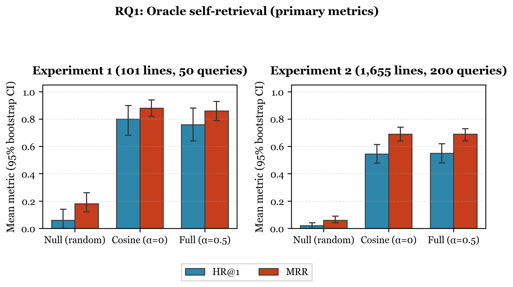

<!-- CADSCOM 2026 — CONDENSED DRAFT (full version: CADSCOM_2026_Revised_Draft.md)
     Prose (Introduction–Conclusion): ~73% of the long draft by word count (~3300 vs ~4500 words).
     RQ1 primary metrics (HR@1, MRR): Figure 1 (PNG in paper_draft/figures/); complementary HR@3/5: Table 2.
     Tables 1, 3–5 unchanged (same numbers/CIs). Target: ~5.5 typeset pages for text+tables+figure, total ≤6 pages
     (excludes abstract + references per CADSCOM template). Verify in Word with the official template.
-->
<!-- Formatting: same as full draft — Georgia 10 pt body, 1 in margins, US Letter, refs MISQ-style -->

<!-- ============================== COVER (not in 6-page count) ============================== -->

# Content-Based Vocal Repertoire Ranking Framework Using Duration-Weighted Pitch Distributions

## Abstract

Vocal repertoire selection affects vocal load and injury risk. Tessitura—how much singing time falls on each pitch, weighted by note length—captures where a line sits in the register. Tessituragram tools typically summarize a score the user already has; they do not rank a library by fit to stated pitch preferences. We present a content-based framework: each vocal line is a tessituragram from machine-readable MusicXML. The user gives range, favorites, and avoids; we range-filter, build an ideal pitch profile, and rank by cosine similarity minus a penalty for duration on avoided pitches (α = 0.5).

We evaluate offline with synthetic self-retrieval: a profile is built from a target line (range; four pitches with most total duration as favorites, two with least as avoids), and we ask how often that same line ranks highly among other filtered lines—an identifiability check, not a user study. Two complementary designs on the OpenScore Lieder corpus (Method) use 101 solo lines (one per work) and 1,655 lines from 1,419 works. We compare to a null (range filter + random ranking) and cosine-only (α = 0).

Full-model HR@1 is 76% vs 6% null (compact design) and 55% vs 2% (expanded); HR@5 is 86% vs 7% null (expanded). Rankings are stable under small preference edits (mean Kendall's τ ≈ 0.84–0.85). Paired full vs cosine-only intervals for HR@1 and mean reciprocal rank include zero in the expanded design; the compact design favors cosine-only on HR@1 for this sample. Results support internal consistency under these offline protocols. Claims are limited to synthetic profiles and symbolic scores; human evaluation and other genres are future work.

**Keywords:** tessitura, tessituragrams, vocal repertoire recommendation, content-based recommendation, cosine similarity, music information retrieval, MusicXML

<!-- ============================== MAIN BODY (6 pages max incl. tables + figures) ============================== -->

## Introduction

Repertoire that matches vocal capability matters for health; mismatch raises strain and injury risk (Apfelbach, 2022; Phyland et al., 1999). **Tessitura**—where the line sits most of the time by duration (Apfelbach, 2022; Schloneger et al., 2024; Thurmer, 1988)—is central to demand. Singers and teachers often filter by written range or Fach; written range does not show how much time is spent in each part of the span, and Fach labels are not consistently defined across contexts (Schloneger et al., 2024).

A **tessituragram** histograms singing time per notated pitch, typically duration-weighted so longer notes count more (Thurmer, 1988; Titze, 2008). Tools such as Tessa (Apfelbach, 2022) extract tessituragrams from MusicXML and report summaries. Those tools are **analytic**: they help judge a piece after it is chosen, not surface new pieces whose tessitura is likely to fit.

We ask whether tessituragrams support **content-based ranking** from stated pitch preferences—an offline, cold-start setting without collaborative signal. Our pipeline filters by range, builds an ideal vector from favorites and avoids, and ranks by cosine similarity minus an avoid penalty. We validate with two offline experiments and synthetic profiles—**different protocols**, not duplicate runs for weight (Method): a compact **101-line** library (one line per work) with i.i.d. bootstrap; and a **flattened** **1,655-line / 1,419-work** library (~**16×** more lines), larger typical |C| after filtering, and cluster bootstrap. **Empirical claims are limited to these offline metrics**, not vocal-health outcomes or unconstrained real-world behavior.

**Contributions.** (1) Tessituragram ranker with favorites/avoids and cosine − α×avoid. (2) **Two-protocol** synthetic self-retrieval plus stability and implementation checks vs null and cosine-only. (3) Expanded-library protocol with **work-level bootstrap** (Cameron et al., 2008; Field and Welsh, 2007).

**Roadmap.** *Results* presents **RQ1** (self-retrieval; **Figure 1** and **Table 2**), **RQ2** (stability), sensitivity to **α**, then **RQ3** (implementation checks).

<!-- Figure 1: RQ1 HR@1/MRR — paper_draft/figures/rq1_oracle_hr1_mrr.png (300 dpi; experiment/visualize_rq1_table2_figure.py). Caption Georgia 10 pt bold, centered, below; spell out "Figure". -->

## Related Work

### *Tessituragram Analysis and Repertoire Selection*

Thurmer (1988) formalized the tessituragram; Titze (2008) emphasized duration weighting. Recent work uses duration- and dose-based summaries across works or cycles (Schloneger et al., 2024; Patinka, 2024). Nix (2014) evaluates objective methods—including tessituragrams—for matching pieces to singers; Apfelbach's Tessa (2022) automates extraction from MusicXML. That line of work supports **evaluating** a selected piece, not **recommending** pieces whose tessitura is likely to fit.

### *Music Information Retrieval*

MIR includes symbolic (score-based) retrieval (Casey et al., 2008; Gurjar and Moon, 2018). Pitch histograms and duration features are common (Corrêa and Rodrigues, 2016). Cosine similarity measures proportional alignment on pitch-indexed vectors (Müller, 2015). For voice, **register matters**: unlike transposition-invariant melodic similarity (Mongeau and Sankoff, 1990), tessitura modelling keeps specific octaves. Our setup parallels query-by-example MIR, but the user supplies pitch preferences rather than an example recording or score (Casey et al., 2008; Müller, 2015).

### *Recommender Evaluation*

Offline evaluation is standard without human relevance labels (Herlocker et al., 2004; Urbano et al., 2013). In music recommendation, offline metrics can align with later A/B tests (Gruson et al., 2019); shared metric code improves comparability (Raffel et al., 2014). We report HR@*k*, MRR, Kendall's τ (Kendall, 1948), and bootstrap uncertainty (Efron and Tibshirani, 1993). When several vocal lines can come from one composition, **cluster bootstrap** resamples works, not lines (Cameron et al., 2008; Field and Welsh, 2007). We are not aware of prior tessitura-based vocal recommenders evaluated with these metrics and explicit baselines. The next section specifies data, scoring, oracle, and bootstrap.

## Method

The section covers data and features (Table 1), the ranking function, and synthetic profiles with bootstrap inference and RQ1 reporting conventions.

### *Data and Song Library*

All sources come from the **OpenScore Lieder Corpus** (CC0; Gotham and Jonas, 2022)—predominantly Lieder and French mélodie. We parse MusicXML with music21 (Cuthbert and Ariza, 2010), extract the vocal line, and map each MIDI pitch to total duration in quarter-note beats (MIDI keeps octaves explicit). Duration weighting reflects that sustaining a pitch is more demanding than a brief note (Titze, 2008). Table 1 lists stored fields.

**Libraries.** Experiment **1**: **101** art songs (e.g. Schubert, Schumann, Debussy, Fauré), one line per composition. Experiment **2**: **1,655** lines from **1,419** compositions (**342** from multi-part works, **1,313** solo). No human relevance judgments.

**Protocols (not independent replications).** Experiment 1 uses a compact single-line-per-work library and **i.i.d.** bootstrap over query-level outcomes. Experiment 2 uses a **flattened** line set and **work-level (cluster) bootstrap** when sampled queries share a composition. The libraries **overlap** in source and repertoire; they are **not** two independent draws from disjoint populations, so they should not be read as doubling evidence.

| Feature | Source | Description |
|---|---|---|
| Pitch, duration (per note) | MusicXML | MIDI + duration in quarter beats → tessituragram. |
| Part/voice | MusicXML | Vocal line only. |
| Tessituragram | Derived | MIDI → total duration. |
| min\_midi, max\_midi | Derived | Written range. |
| Composer, title, filename | Corpus | Identification. |

**Table 1. Features per vocal line (MusicXML-derived).**

### *Ranking Framework and Scoring*

**Inputs:** vocal range (MIDI); favorites; avoids.

**Range filter:** keep works whose written range ⊆ user range (candidate set **C**).

**Ideal vector:** dense over [min\_midi, max\_midi]; base weight **0.2**, **+1.0** at favorites, **−1.0** at avoids; clamp negatives to **0**; **L2**-normalize so similarity is directional (Müller, 2015). The base keeps non-favorite in-range pitches from vanishing before normalization; we do not sweep it.

**Song vectors:** tessituragram → dense; **L1**-normalize to duration proportions; **avoid\_penalty** = proportion of vocal duration on avoided pitches.

> final\_score = cosine(song, ideal) − α × avoid\_penalty  

Main experiments: **α = 0.5**. Scores rounded to **four** decimals; ties broken by filename.

### *Synthetic Profiles and Inference*

**Oracle.** For a **profile line**, the user's range equals that line's written range; favorites are the top **4** pitches by duration and avoids the bottom **2**, disjoint. This **fixed sparse oracle** is a test harness—not claimed psychologically realistic—but it yields a reproducible **identifiability target**. **Synthetic self-retrieval** asks whether the ranker recovers that line among range-filtered **others**, not whether human judges would agree (Herlocker et al., 2004; Urbano et al., 2013).

**Experiment 1.** **50** queries uniformly without replacement from the valid pool (|C| ≥ 2; **seed 42**). **10,000** **i.i.d.** bootstrap resamples of query- (or baseline-) level outcomes.

**Experiment 2.** Up to **200** queries uniformly without replacement from **eligible lines** (not compositions), **seed 42**; multi-part works are therefore **oversampled** relative to uniform-by-work. **Cluster** bootstrap: resample work IDs with replacement, then include all query lines from sampled works (**seed 43** for RQ1 bootstrap). Canonical JSON: `experiment_results/` (Experiment 2); `previous_paper_and_experiments/previous_experiment_results/old_*.json` (Experiment 1). Experiment 1 α-sensitivity for τ loads the **five** RQ2 `baseline_profiles` from `old_RQ2_results.json` (**130** perturbations, matching Table 3). Experiment 2 α-sensitivity uses SHA-256–derived bootstrap RNGs per cell where documented in `experiment/run_alpha_sensitivity.py`.

**Inference.** Bootstrap percentile intervals summarize uncertainty for the **mean** query-level metric on the **fixed** sampled queries; they are **not** intervals over redrawn query sets. RQ3 pools Spearman correlations via Fisher's **z** (Fisher, 1915). RQ1 main results and baselines use the **same** query draw. **HR@1** and **MRR** are primary oracle metrics; **HR@3/5** are complementary. Paired full vs cosine-only uses the same queries; we do **not** apply multiplicity correction across metrics—secondary contrasts are exploratory.

## Results

We report **RQ1** (oracle self-retrieval), **RQ2** (stability), **α-sensitivity**, and **RQ3** (implementation). **Figure 1** and **Table 2** reproduce canonical JSON outputs for the stated seeds and paths (Method).

### *RQ1: Self-Retrieval*

**Question:** When preferences are synthesized from a vocal line's own tessituragram, **how often** does the system rank that **same line** first (or in the top 3 or 5) among range-filtered candidates?

The profile uses a **coarse** summary (top-4 favorite and bottom-2 avoid MIDI pitches). **RQ1** tests whether the scoring pipeline recovers the generating item among *other* range-filtered candidates under this fixed sparse encoding—a **pipeline identifiability** check, not human endorsement or supervised accuracy against external judgments (Herlocker et al., 2004; Urbano et al., 2013).

**Experiment 1.** Valid pool: **95**/101 lines with |C| ≥ 2; **50** queries (seed 42). Models: full (α = 0.5), cosine-only (α = 0), null (range filter + uniform random permutation over |C|). For this draw, |C| has median **28**, mean **34**, mean 1/|C| ≈ **0.071**. Under the null, expected mean HR@1 given observed |C| equals the sample mean of 1/|C|; the observed null HR@1 **6%** (Figure 1) is consistent with that benchmark given Monte Carlo variation.

**Experiment 2.** **1,647** qualified lines; **200** queries (192 distinct compositions). |C|: median **263**, mean **374**, min **3**, max **1,386**; mean 1/|C| = **0.017**; **9%** of queries have |C| ≤ 20. **Descriptive** stratification (no CIs): among **18** queries with 2 ≤ |C| ≤ 20, full HR@1 **0.89**, null **0.17** (mean 1/|C| = 0.11); among **182** with |C| ≥ 21, full **0.52**, null **0.006** (mean 1/|C| = 0.008). Aggregate null HR@1 **2%** sits near mean 1/|C| (**1.7%**).

**Summary.** **Figure 1** plots primary metrics **HR@1** and **MRR**; **Table 2** lists complementary **HR@3** and **HR@5**. Experiment 1: full HR@1 **0.76**, MRR **0.86**; cosine **0.80** / **0.88** on the same queries; paired ΔHR@1 = **−0.04**, 95% CI **[−0.10, 0.00]** (i.i.d. on per-query differences). Experiment 2: full **0.55** / **0.69**; cosine HR@1 **0.545**. Raw HR@1 is lower in Experiment 2, but the phases are **not** a controlled comparison: different corpus subsets, |C| distributions, null difficulty (mean 1/|C| ≈ **0.071** vs **0.017**), and Experiment 2's uniform draw over **lines** (not works). HR@5: **0.86** (Exp 2) vs **1.00** (Exp 1). Both strongly beat null (**6%** / **2%** HR@1). Experiment 2: paired ΔHR@1 **0.005**, CI **[−0.04, 0.05]**; ΔMRR **−0.002**, **[−0.03, 0.02]**; ΔHR@3 **+0.025**, **[0.00, 0.05]** (lower endpoint 0; not treated as primary); ΔHR@5 **+0.005** (CI includes zero; not tabulated). Among queries where the target is not first (**45%**), other lines can have similar duration-weighted profiles, producing ties or near-ties under cosine similarity.

**Figure 1.** Oracle self-retrieval for **HR@1** and **MRR** (95% bootstrap percentile CIs; fixed query draw—see Method). Experiment 1: i.i.d. bootstrap. Experiment 2: cluster bootstrap. Full vs cosine HR@1 in Experiment 2: **0.550** vs **0.545**.

| Model | Exp 1 HR@3 | Exp 1 HR@5 | Exp 2 HR@3 | Exp 2 HR@5 |
|---|---|---|---|---|
| Null (random) | 0.18 [0.08, 0.30] | 0.30 [0.18, 0.42] | 0.06 [0.03, 0.09] | 0.07 [0.04, 0.11] |
| Cosine-only (α = 0) | 1.00 [1.00, 1.00] | 1.00 [1.00, 1.00] | 0.78 [0.72, 0.83] | 0.86 [0.80, 0.90] |
| Full (α = 0.5) | 0.98 [0.94, 1.00] | 1.00 [1.00, 1.00] | 0.80 [0.74, 0.86] | 0.86 [0.81, 0.91] |

**Table 2.** Complementary **HR@3** and **HR@5** (95% bootstrap percentile CIs; same schemes as Figure 1).

### *RQ2: Ranking Stability*

**Question:** When we add or remove one favorite note or note to avoid, how similar is the new ranking to the original?

**Design.** Experiment 1: **5** baseline profiles (|C| ≥ 10), **130** total perturbations. Experiment 2: **20** baselines (|C| ≥ 10), **580** perturbations, all **20** from distinct compositions. For each baseline we obtain the reference ranking and generate all one-note perturbations (add or remove one favorite or avoid). We compute Kendall's **τ** between the original and perturbed rankings (Kendall, 1948); τ ∈ [−1, 1], with values above **0.7** indicating strong agreement. Table 3 gives mean τ per baseline with 95% CI. **τ** measures how much the induced ranking moves under local edits to the **encoded** preference lists; it does not validate pedagogical acceptance or user satisfaction with such edits.

Mean τ for the full model: **0.85** (Exp 1) and **0.84** (Exp 2); cosine-only slightly higher (**~0.87**), overlapping CIs; null near **0**. Both protocols show strong stability despite **16×** more lines and four times as many baselines in Experiment 2.

| Model | Experiment 1 (5 baselines, 130 pert.) | Experiment 2 (20 baselines, 580 pert.) |
|---|---|---|
| | Mean τ (95% CI) | Mean τ (95% CI) |
| Null (random) | −0.04 [−0.05, −0.02] | 0.00 [−0.00, 0.01] |
| Cosine-only (α = 0) | 0.87 [0.84, 0.91] | 0.87 [0.86, 0.88] |
| Full (α = 0.5) | 0.85 [0.81, 0.88] | 0.84 [0.82, 0.85] |

**Table 3.** Ranking stability: mean Kendall's τ per baseline (95% CI). τ = 1 means identical order; τ near 0 means unrelated rankings.

### *Sensitivity to α*

To assess sensitivity to the avoid-penalty weight, we repeated self-retrieval and stability for α ∈ {0.0, 0.25, 0.5, 0.75, 1.0} using the **same** random query draws and **same** RQ2 baseline sets as in Figure 1 and Tables 2–3 (Experiment 1: the five baselines tied to the Table 3 protocol and **130** perturbations; Experiment 2: twenty baselines and **580** perturbations). Table 4 reports HR@1, MRR, and mean τ per baseline for each α.

| α | | Experiment 1 (101 lines) | | | Experiment 2 (1,655 lines) | | |
|---|---|---|---|---|---|---|---|
| | HR@1 (95% CI) | MRR (95% CI) | Mean τ (95% CI) | HR@1 (95% CI) | MRR (95% CI) | Mean τ (95% CI) |
| 0.0 | 0.80 [0.68, 0.90] | 0.88 [0.81, 0.94] | 0.87 [0.84, 0.91] | 0.55 [0.48, 0.61] | 0.69 [0.64, 0.74] | 0.87 [0.86, 0.88] |
| 0.25 | 0.78 [0.66, 0.88] | 0.87 [0.80, 0.94] | 0.86 [0.83, 0.88] | 0.56 [0.49, 0.62] | 0.69 [0.64, 0.74] | 0.85 [0.84, 0.86] |
| 0.5 | 0.76 [0.64, 0.88] | 0.86 [0.79, 0.93] | 0.85 [0.81, 0.88] | 0.55 [0.48, 0.62] | 0.69 [0.64, 0.73] | 0.84 [0.82, 0.85] |
| 0.75 | 0.76 [0.64, 0.88] | 0.86 [0.79, 0.93] | 0.83 [0.80, 0.87] | 0.54 [0.47, 0.61] | 0.68 [0.63, 0.73] | 0.83 [0.81, 0.84] |
| 1.0 | 0.80 [0.68, 0.90] | 0.88 [0.81, 0.94] | 0.83 [0.78, 0.86] | 0.54 [0.47, 0.61] | 0.67 [0.62, 0.72] | 0.82 [0.80, 0.83] |

**Table 4.** Alpha sensitivity (same query draws and RQ2 baselines as Figure 1 and Tables 2–3): self-retrieval (HR@1, MRR) and stability (mean τ) across α (95% CI). Experiment 1: i.i.d. bootstrap. Experiment 2: cluster bootstrap for RQ1 metrics (see Method).

Across α, HR@1 and MRR stay in a similar band within each experiment; HR@1 need not move monotonically with α on a fixed draw (e.g. Experiment 2). Mean τ **decreases monotonically** as α increases (**0.87→0.83** Exp 1; **0.87→0.82** Exp 2), yet τ remains ≥ **0.82** at α = 1. We report **α = 0.5** in the main tables as a fixed point between cosine-only and stronger penalty—we do **not** claim an optimal α from these offline metrics alone.

### *RQ3: Implementation*

We verify (a) meaningful spread of scores, (b) numerical identity **final\_score = cos − 0.5×avoid**, and (c) Spearman correlations in the directions implied by the formula (Spearman, 1904), aggregated via Fisher's **z** (Fisher, 1915). Experiment 1: **25** profiles (|C| ≥ 10); Experiment 2: **50** profiles (49 distinct works). Table 5.

| Quantity | Experiment 1 (25 profiles) | Experiment 2 (50 profiles) |
|---|---|---|
| max \|final − (cos − 0.5×avoid)\| | 0 | 0 |
| OLS (cos, avoid, R²) | 1.0, −0.5, 1.0 | 1.0, −0.5, 1.0 |
| Mean range (final\_score) | 0.76 | 1.03 |
| ρ(final, cos) | 0.987 | 0.989 |
| ρ(final, avoid) | −0.35 | −0.32 |
| ρ(cos, favorite\_overlap) | 0.935 | 0.921 |

**Table 5.** RQ3 implementation checks. Regression uses final\_score, cosine similarity, and avoid penalty at α = 0.5. Spearman ρ aggregated across profiles via Fisher's z.

## Discussion and Limitations

Taken together, the offline evidence supports **internal consistency** of the representation and scoring: range filtering plus cosine similarity on duration-weighted pitch profiles **strongly beats** a range-filtered random ranker and remains **stable** under small, realistic perturbations to the encoded preference lists. The two protocols are **aligned in direction** (e.g. mean τ for the full model **0.85** vs **0.84**; RQ3 identity and regression checks at α = 0.5), but they are **not** statistically independent confirmations—the libraries overlap and answer different design questions (compact single-line-per-work vs flattened multi-line corpus). That alignment is nevertheless useful: it shows the same scorer behaves sensibly under both i.i.d. and cluster bootstrap schemes appropriate to each sampling frame.

**RQ1** demonstrates that, under synthetic self-retrieval, the system often places the generating line at the top of a large filtered pool—far above chance—while **RQ2** shows rankings are not brittle to single-note edits. **α-sensitivity** indicates that main conclusions are not artifacts of a single α: HR@1 and MRR remain in a similar band across α, while τ declines gradually as the avoid term gains weight—exactly the trade-off one would expect if the avoid penalty can reorder lists without destroying cosine structure. None of this substitutes for studies with human listeners; it establishes that the **implemented** pipeline matches the **stated** mathematics and behaves coherently on a substantial symbolic corpus.

The drop in raw HR@1 from **0.76** to **0.55** (full model) **confounds** corpus composition, |C|, null difficulty, and line-level sampling weights; it is not identified with library size alone. In Experiment 2, HR@5 for the full model is **0.86** (Table 2). On primary RQ1 metrics (**HR@1**, **MRR**), paired intervals do **not** separate full vs cosine-only in Experiment 2; Experiment 1's paired ΔHR@1 favors cosine on this draw—choosing between them is **not** dictated by these offline results alone. The avoid term remains meaningful when users supply avoids; our oracle defines avoids from the **least-used** pitches of the target, which limits how much the penalty can separate the target from near-duplicate lines—**paired full-versus-cosine contrasts here mainly probe cosine similarity**, not a high-signal test of user-supplied avoids. Bootstrap schemes differ only where Experiment 2 requires cluster resampling (Method).

**Limitations.** (1) **Scope of inference.** Results average over a **fixed** query sample (seed 42) from one corpus with a shared candidate pool; query outcomes need not be independent across lines from the same composition in Experiment 2. Bootstrap percentile intervals quantify resampling uncertainty for **that** sample under the stated scheme; they are not inference to all repertoire or to repeated query redraws. Full versus cosine-only in RQ1 uses marginal CIs plus paired bootstrap contrasts on the same queries, **without** multiplicity adjustment across metrics—secondary contrasts should be read as exploratory. (2) **No human judgments; synthetic self-retrieval.** Experiments use automatically generated profiles. RQ1 is a **controlled identifiability** check (whether the scorer recovers the generating item among distractors), not evidence that the system models unconstrained preferences or that users would be satisfied with the rankings. (3) **Cross-experiment numeric comparisons** are **descriptive** only: they mix different corpus subsets, overlapping repertoire, candidate-set sizes, null benchmarks (mean 1/|C|), and (in Experiment 2) uniform sampling over eligible **lines** rather than compositions. They do not support a causal claim about library size alone, nor do two columns amount to independent replication. (4) **Single corpus** (OpenScore Lieder), primarily nineteenth- and early-twentieth-century European art song. (5) **Pitch and duration only**—dynamics, tempo, text setting, and accompaniment difficulty are not modelled. (6) **Avoid penalty vs cosine-only.** Paired contrasts on HR@1 and MRR in Experiment 2 include zero; Experiment 1's paired ΔHR@1 interval lies below zero (cosine higher on this draw). HR@3 paired Δ in Experiment 2 has a lower bootstrap endpoint of zero (Table 2 narrative). We do not test user-supplied avoids separately from the oracle.

## Conclusion

We presented a content-based framework that ranks vocal repertoire using duration-weighted tessituragrams and user-specified range, favorites, and avoids, scored as cosine similarity minus an avoid penalty. Across **two offline protocols**—compact single-line-per-work (101 lines) and expanded flattened (1,655 lines / 1,419 compositions)—the full model and cosine-only **strongly outperform** a null baseline on **synthetic self-retrieval**; rankings stay stable under small perturbations (mean τ ≥ **0.82** for the full model at every α in Table 4). RQ3 confirms **final = cos − α×avoid** exactly. Mean stability is similar across protocols (τ ≈ **0.85** vs **0.84**); Experiment 2 HR@5 is **0.86**. Paired contrasts on primary self-retrieval metrics do **not** support a systematic mean advantage for the avoid penalty over cosine-only under our oracle. Future work should add human preferences and judgments, diversify repertoire, and extend features beyond pitch and duration.

<!-- ============================== REFERENCES (not in 6-page count) ============================== -->

## References

Apfelbach, C. S. 2022. "Tessa: A Novel MATLAB Program for Automated Tessitura Analysis," *Journal of Voice* (36:5), pp. 599–607. (https://doi.org/10.1016/j.jvoice.2020.07.039).

Cameron, A. C., Gelbach, J. B., and Miller, D. L. 2008. "Bootstrap-Based Improvements for Inference with Clustered Errors," *Review of Economics and Statistics* (90:3), pp. 414–427. (https://doi.org/10.1162/rest.90.3.414).

Casey, M. A., Veltkamp, R., Goto, M., Leman, M., Rhodes, C., and Slaney, M. 2008. "Content-Based Music Information Retrieval: Current Directions and Future Challenges," *Proceedings of the IEEE* (96:4), pp. 668–696. (https://doi.org/10.1109/JPROC.2008.916370).

Corrêa, D. C., and Rodrigues, F. A. 2016. "A Survey on Symbolic Data-Based Music Genre Classification," *Expert Systems with Applications* (60), pp. 190–210. (https://doi.org/10.1016/j.eswa.2016.04.008).

Cuthbert, M. S., and Ariza, C. 2010. "music21: A Toolkit for Computer-Aided Musicology and Symbolic Music Data," in *Proceedings of the 11th International Society for Music Information Retrieval Conference*, pp. 637–642. (https://ismir2010.ismir.net/proceedings/ismir2010-108.pdf).

Efron, B., and Tibshirani, R. J. 1993. *An Introduction to the Bootstrap*, New York, NY: Chapman and Hall/CRC. (https://doi.org/10.1201/9780429246593).

Field, C. A., and Welsh, A. H. 2007. "Bootstrapping Clustered Data," *Journal of the Royal Statistical Society: Series B* (69:3), pp. 369–390. (https://doi.org/10.1111/j.1467-9868.2007.00593.x).

Fisher, R. A. 1915. "Frequency Distribution of the Values of the Correlation Coefficient in Samples from an Indefinitely Large Population," *Biometrika* (10:4), pp. 507–521. (https://doi.org/10.1093/biomet/10.4.507).

Gotham, M. R. H., and Jonas, P. 2022. "The OpenScore Lieder Corpus," in *Music Encoding Conference Proceedings 2021*, S. Münnich and D. Rizo (eds.), Humanities Commons, pp. 131–136. (https://doi.org/10.17613/1my2-dm23).

Gruson, A., Chandar, P., Charbuillet, C., McInerney, J., Hansen, S., Tardieu, D., and Carterette, B. 2019. "Offline Evaluation to Make Decisions about Playlist Recommendation Algorithms," in *Proceedings of the 12th ACM International Conference on Web Search and Data Mining*, New York, NY: ACM, pp. 420–428. (https://doi.org/10.1145/3289600.3291027).

Gurjar, K., and Moon, Y. S. 2018. "A Comparative Analysis of Music Similarity Measures in Music Information Retrieval Systems," *Journal of Information Processing Systems* (14:1), pp. 32–55. (https://jips-k.org/digital-library/2018/14/1/32).

Herlocker, J. L., Konstan, J. A., Terveen, L. G., and Riedl, J. T. 2004. "Evaluating Collaborative Filtering Recommender Systems," *ACM Transactions on Information Systems* (22:1), pp. 5–53. (https://doi.org/10.1145/963770.963772).

Kendall, M. G. 1948. *Rank Correlation Methods*, London, UK: Charles Griffin. (https://search.worldcat.org/title/3641982).

Mongeau, M., and Sankoff, D. 1990. "Comparison of Musical Sequences," *Computers and the Humanities* (24:3), pp. 161–175. (https://doi.org/10.1007/BF00117340).

Müller, M. 2015. *Fundamentals of Music Processing: Audio, Analysis, Algorithms, Applications*, Cham, Switzerland: Springer. (https://doi.org/10.1007/978-3-319-21945-5).

Nix, J. 2014. "Measuring Mozart: A Pilot Study Testing the Accuracy of Objective Methods for Matching a Song to a Singer," *Journal of Singing* (70:5), pp. 561–572.

Patinka, P. M. 2024. "Quantitative Analysis of Tessitura and Density in Franz Schubert's Die schöne Müllerin," *Journal of Voice*, Advance online publication. (https://doi.org/10.1016/j.jvoice.2024.09.035).

Phyland, D. J., Oates, J. M., and Greenwood, K. M. 1999. "Self-Reported Voice Problems among Three Groups of Professional Singers," *Journal of Voice* (13:4), pp. 602–611. (https://doi.org/10.1016/S0892-1997(99)80014-9).

Raffel, C., McFee, B., Humphrey, E. J., Salamon, J., Nieto, O., Liang, D., and Ellis, D. P. W. 2014. "mir_eval: A Transparent Implementation of Common MIR Metrics," in *Proceedings of the 15th International Society for Music Information Retrieval Conference*, pp. 367–372. (https://archives.ismir.net/ismir2014/poster/000039.pdf).

Schloneger, M., Hunter, E. J., and Maxfield, L. 2024. "Quantifying Vocal Repertoire Tessituras through Real-Time Measures," *Journal of Voice* (38:1), pp. 247.e11–247.e25. (https://doi.org/10.1016/j.jvoice.2021.06.019).

Spearman, C. 1904. "The Proof and Measurement of Association between Two Things," *American Journal of Psychology* (15:1), pp. 72–101. (https://doi.org/10.2307/1412159).

Thurmer, S. 1988. "The Tessiturogram," *Journal of Voice* (2:4), pp. 327–329. (https://doi.org/10.1016/S0892-1997(88)80025-0).

Titze, I. R. 2008. "Quantifying Tessitura in a Song," *Journal of Singing* (65:1), pp. 59–61. (https://vocology.utah.edu/_resources/documents/quantifying_tessitura_titze.pdf).

Urbano, J., Schedl, M., and Serra, X. 2013. "Evaluation in Music Information Retrieval," *Journal of Intelligent Information Systems* (41:2), pp. 345–369. (https://doi.org/10.1007/s10844-013-0249-4).
